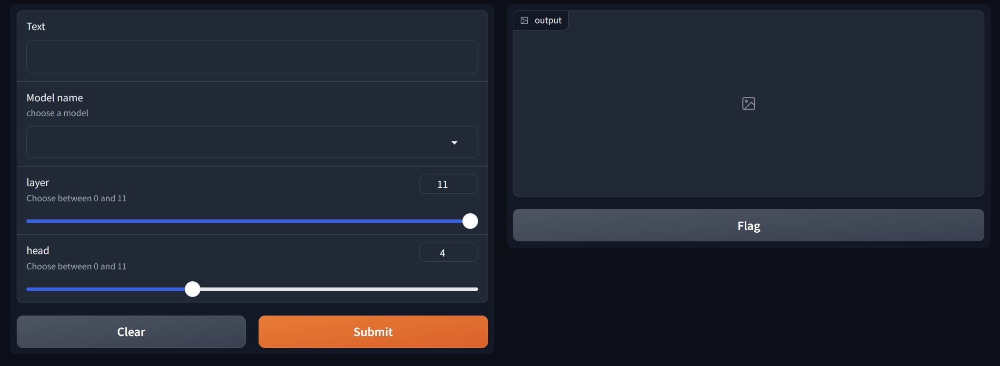
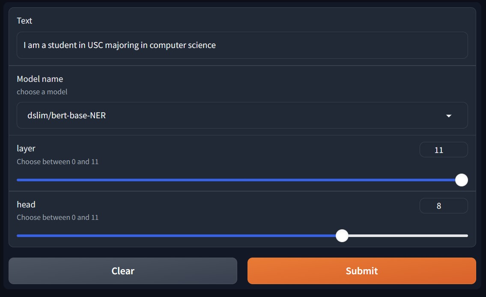
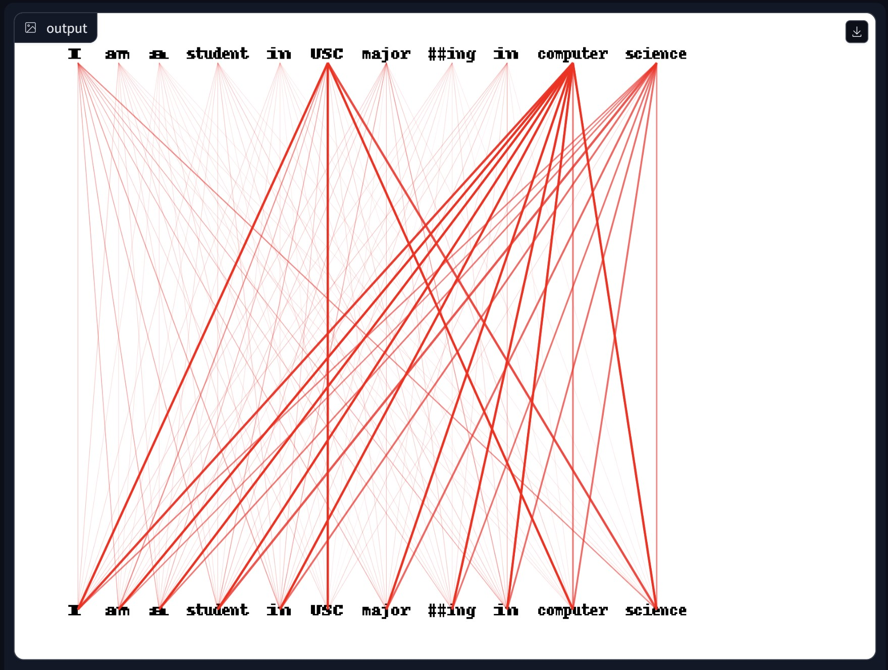

# Visualize NLP Model Attentions using OpenGL
Project for CSCI 596 Fall 2023

## Goals
The primary goal of this project is to create an interactive web application that focuses on visualizing attention mechanisms in Natural Language Processing (NLP) models using OpenGL. We aim to provide a compelling and intuitive way for users to explore and understand the attention patterns within NLP models. We render our visualizations using OpenGL which is an unconventional approach. This aspect serves as a valuable learning experience for us, allowing us to acquire new skills and insights into graphics rendering.


## Technologies 
1. [Gradio](https://www.gradio.app/) is a fast way to demo machine learning model with a friendly web interface so that anyone can use it in anywhere!
2. [Opengl](https://www.opengl.org/) is a cross-language, cross-platform application programming interface for rendering 2D and 3D vector graphics. 

## Results
1. Dashboard

2. User Inputs

3. Attention Visualization


## Reproduce
### Prerequisite
```bash
# Windows
# pip3 install torch torchvision torchaudio --index-url https://download.pytorch.org/whl/cu121 # Windows

# Linux
# pip3 install torch torchvision torchaudio
```
```bash
pip install -r requirements.txt
```

### Main Entry
```bash
python gradio_start.py
```
